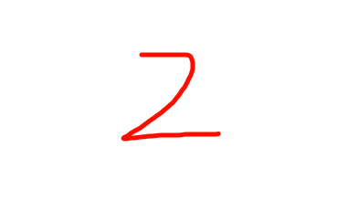
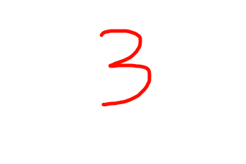

    

        
    

    

        
    

    

        
    

    <button class="prev" onclick="plusSlides(-1)">❮</button>
    <button class="next" onclick="plusSlides(1)">❯</button>

- [红船精神](/RedShipMind/ )

- [井冈山精神](/JinggangshanMind/)

- [长征精神](/ChangzhengMind/)

- [延安精神](/YananMind/)

- [西柏坡精神](/XibopuMind/)

- [其他精神1](/OtherMind1/)

- [其他精神2](/OtherMind2/)

- [其他精神3](/OtherMind3/)

- [其他精神4](/OtherMind4/)

-   每月推荐:

    ---

    - [五四青年节](/54/ )

    - [推荐2](/recommend2/)

    - [推荐3](/recommend3/)

    - [推荐4](/recommend4/)

    - [推荐5](/recommend5/)

- 地图:点击可直接跳转百度地图搜索四川省

    ---

    &from=webmap&biz_forward=%7B%22scaler%22:1,%22styles%22:%22pl%22%7D&device_ratio=1){target="_blank"}

